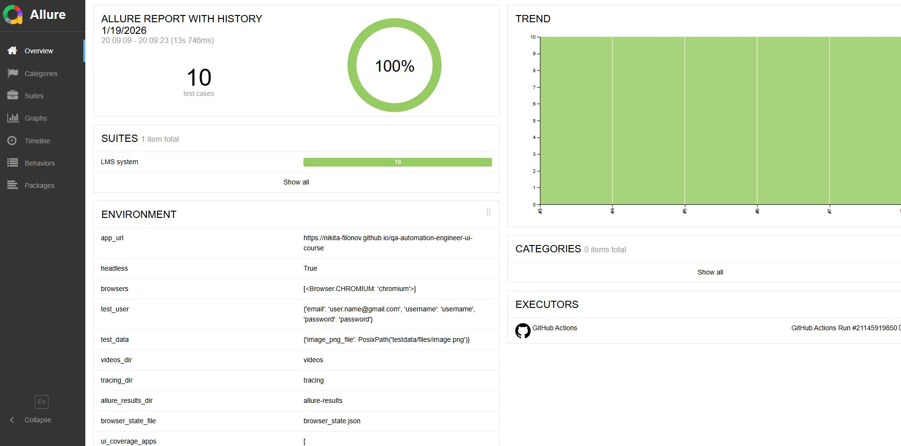
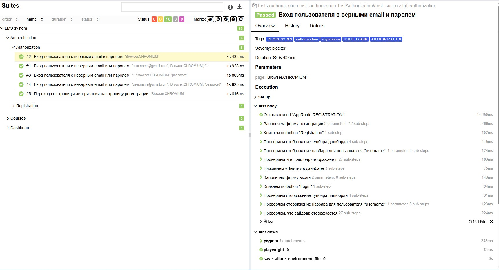

# UI Автотесты — Playwright + Python

Фреймворк для автоматизированного тестирования веб-приложения
[UI Course Test Application](https://nikita-filonov.github.io/qa-automation-engineer-ui-course/#/auth/login).




---

## Ключевые особенности

- **Паттерны:** Page Object, Page Component, Page Factory
- **Кросс-браузерное тестирование:** Chromium, WebKit, Firefox
- **Оптимизированная авторизация** — browser state сохраняется один раз и переиспользуется во всей сессии
- **data-test-id** — самостоятельно внёс атрибуты в исходный код тестируемого приложения для стабильной и явной локации элементов без хрупких CSS/XPath-селекторов
- **CI/CD:** GitHub Actions → автозапуск тестов → публикация Allure-отчёта на GitHub Pages
- **Allure Report:** видео прохождения, трейсы Playwright, метаинформация по каждому тесту

---
 
## Как устроена авторизация
 
В проекте две фикстуры для работы с браузером — `page` и `page_with_state`.
 
**`page`** — обычная страница без авторизации, для тестов где логин не нужен.
 
**`page_with_state`** — страница с готовым авторизованным контекстом. Работает так:
 
1. Фикстура `initialize_browser_state` с `scope="session"` запускается **один раз за всю тестовую сессию**
2. Открывает браузер, регистрирует тестового пользователя через UI
3. Сохраняет состояние браузера (куки, localStorage) в `browser_state.json` через `context.storage_state()`
4. Все последующие тесты через `page_with_state` получают **готовый авторизованный контекст** из этого файла — без повторных запросов к auth

---

## Технологии

| Инструмент | Назначение |
|---|---|
| Python | Язык разработки |
| Playwright | Браузерная автоматизация |
| Pytest | Фреймворк для тестов, фикстуры, параметризация |
| Allure | Отчётность: видео, трейсы, шаги |
| Pydantic | Модели конфигурации и тестовых данных |
| GitHub Actions | CI/CD пайплайн |

---

## Структура проекта

```
autotests-playwright/
├── pages/               # Page Object — страницы приложения
├── components/          # Page Component — переиспользуемые компоненты
├── templates/           # Page Factory — фабрика страниц
├── elements/            # Базовые элементы UI
├── tests/               # Тест-кейсы
├── fixtures/            # Pytest-фикстуры
├── testdata/            # Тестовые данные и файлы
├── tools/               # Вспомогательные утилиты
├── training_examples/   # Примеры и обучающие материалы
├── conftest.py          # Глобальные фикстуры и настройки
├── config.py            # Конфигурация окружения (Pydantic)
├── pytest.ini           # Настройки Pytest
└── requirements.txt     # Зависимости
```

---

## Запуск тестов

### 1. Клонировать репозиторий

```bash
git clone https://github.com/DmitriyFrolov2/autotests-playwright.git
cd autotests-playwright
```

### 2. Создать виртуальное окружение и установить зависимости

```bash
python -m venv venv
source venv/bin/activate  # Windows: venv\Scripts\activate
pip install -r requirements.txt
```

### 3. Установить браузеры Playwright

```bash
playwright install
```

### 4. Запустить тесты с генерацией Allure-отчёта

```bash
pytest -m "regression" --alluredir=./allure-results
```

### 5. Открыть отчёт локально

```bash
allure serve allure-results
```

---

## Allure-отчёт

Актуальный отчёт публикуется автоматически после каждого запуска CI:

🔗 [Открыть Allure Report](https://dmitriyfrolov2.github.io/autotests-playwright/8/index.html)



---

## Кросс-браузерные конфигурации

В репозитории представлены отдельные конфигурации для разных комбинаций браузеров:

- `chromium-webkit/` — Chromium + WebKit
- `chromium-webkit-firefox/` — все три браузера
- `webkit-firefox/` — WebKit + Firefox
